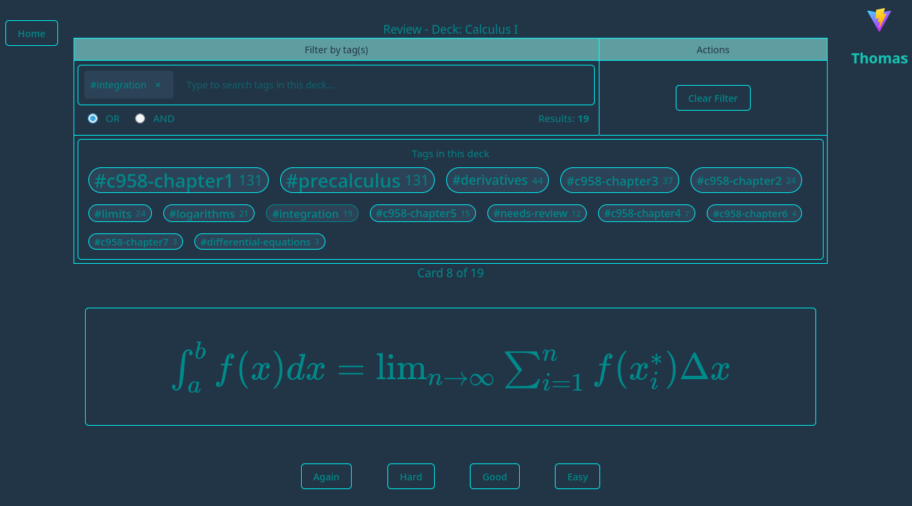
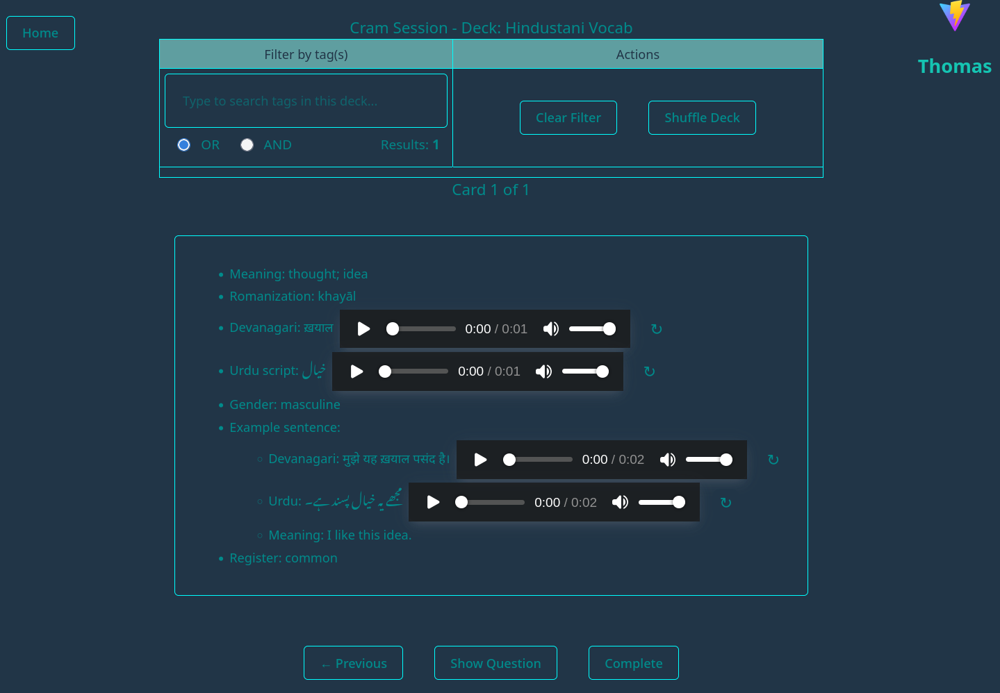

# Ai Forgot These Cards

A self-hosted, AI-assisted flashcard web app with a built-in Spaced Repetition System (SRS): create decks, cards, and tags, study via SRS Review or Cram mode, generate and play multilingual text-to-speech audio, and use AI while authoring cards — from per-card assistance to whole-deck AI tools.

Your data stays yours: it lives in a database you control (PostgreSQL by default, or SQLite single-file mode) with export/import for moving between them.

## Features

### Studying

- **SRS Review sessions** (global or per-deck) with due/new/reviewed/total counts; ratings update scheduling
- **Cram mode** for full-deck study without affecting SRS schedules
- **Tag filtering** and a **tag cloud** in Cram and Review
- **Markdown** and **LaTeX** rendering in cards (including tables and syntax highlighting)
- **Deck templates** for new-card defaults and render-only content shown with every card

### AI assistance (optional)

AI features talk to any **OpenAI-compatible** API — a hosted provider with an API key, or a **local llama.cpp** server — and are disabled entirely if you configure nothing:

- Chat with an LLM while authoring individual cards
- **Bulk AI tools** in the bulk entry editor that operate on the whole deck draft:
  - **Generate** additional cards (1–100) at a chosen difficulty, optionally for selected topics
  - **Correct** factual inaccuracies and **enhance** explanations/formatting
  - **Suggest** additive tags reusing existing deck tag names
  - **Find duplicates** with reviewed, selectable merge proposals (the survivor keeps its review history)
  - **Fill topic gaps** by suggesting underrepresented topics
- Changes stay staged in the editor until you save; before/after comparison, one-level undo, and strict response validation mean partial or malformed AI output is never applied

### Card management

- **Bulk entry/updating** editor with search, filtering, and sorting across all deck cards
- Deck/card/tag management with per-deck and per-card configuration

### Multilingual TTS (optional)

- On-demand speech generation and playback, with multiple languages per card
- Deck/card-level voice and language configuration, semantic target/variant support, and script-aware font rendering
- Hugging Face models, WAV caching, build-time model preloading, and CPU- or GPU-capable sidecar images

### Operations

- **Export/import** your data, including a portable format for moving between Postgres and SQLite
- **PostgreSQL** (default) or **SQLite** single-file mode
- Containerized build + deployment (no local JDK/Node required for the default workflow) or standalone WAR deployment
- **Swagger/OpenAPI** API docs, Spring Boot Actuator endpoints, and admin user management
- Login sessions with CSRF protection

## Installation

Two supported installation paths:

1. **GitHub Releases (WAR artifacts)**
   - Download: <https://github.com/darkmusic/ai-forgot-these-cards/releases>
   - Install guide: <https://darkmusic.github.io/ai-forgot-these-cards/releases.html>

2. **Prebuilt container images (GHCR)**
   - Images:
     - `ghcr.io/darkmusic/ai-forgot-these-cards-app`
     - `ghcr.io/darkmusic/ai-forgot-these-cards-web`
   - Install guide: <https://darkmusic.github.io/ai-forgot-these-cards/container-images.html>

For the fastest path, see the [Quickstart](https://darkmusic.github.io/ai-forgot-these-cards/getting-started.html) guide.

## Quick links

- Documentation: <https://darkmusic.github.io/ai-forgot-these-cards/overview.html>
- AI integration (hosted providers or local llama.cpp): <https://darkmusic.github.io/ai-forgot-these-cards/ai-integration.html>
- Bulk editor AI tools: <https://darkmusic.github.io/ai-forgot-these-cards/bulk-ai-tools.html>
- Text-to-speech setup: <https://darkmusic.github.io/ai-forgot-these-cards/text-to-speech.html>
- Configuration reference: <https://darkmusic.github.io/ai-forgot-these-cards/configuration.html>
- Frontend repo: <https://github.com/darkmusic/ai-forgot-this-frontend>
- Contributing / releases: [CONTRIBUTING.md](CONTRIBUTING.md)
- License: [LICENSE.txt](LICENSE.txt)