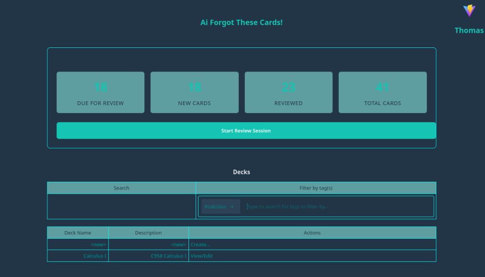

## Ai Forgot These Cards!
This is an AI-assisted flashcard creation and quiz website.

The _AI-assisted_ part is to enable chatting with an LLM during creation/editing of a flashcard.

This project consists of two parts:

1. **Backend** (this repo): [Java/Spring, JPA/Hibernate, PostgreSQL](https://github.com/darkmusic/ai-forgot-these-cards)
2. **Frontend** [ai-forgot-this-frontend](https://github.com/darkmusic/ai-forgot-this-frontend): [React](https://github.com/darkmusic/ai-forgot-this-frontend), [TypeScript](https://www.typescriptlang.org/), [Vite](https://vite.dev/)

Features:
- Admin management
- Spring Security
- User profiles
- Ollama integration
  - List models
  - Add/pull model
  - Chat with model
- Deck management
- Card management
- Quiz

Runtime Requirements:
- Java Runtime, currently tested with Java 24 (GraalVM-24.0.1+9.1)
- PostgreSQL - A PostgreSQL container must be up and running (see [compose.yaml](compose.yaml)) or another existing PostgreSQL server must be available
- Ollama must be installed and running
- Docker/Rancher Desktop/etc. (Note that Podman currently is not supported)

### Screenshots
Here are some screenshots of the application:
1. **Login Screen**:

   
2. **User Home Page, showing User Context Menu**:
   
3. **User Settings**:
   
4. **Deck Management**:
   
5. **View Card**:
   
6. **Edit Card**:
   
7. **Create Card (With AI Assistance)**:
   
8. **Quiz (Front of card)**:
   
9. **Quiz (Back of card)**:
   
10. **Admin Home**:
    
11. **Add User**:
    
12. **Add Model**:
    

### General Remarks
- This project is a work-in-progress and is intended for educational purposes only.
- The AI integration is done using [Ollama](https://ollama.com/), which must be installed and running on your local machine. You can add models to Ollama and use them in the application.
- The frontend is a submodule of this repository, so you will need to clone the frontend separately or initialize and update submodules after cloning this repo.
- The application uses PostgreSQL as the database, and you can run it using Docker, Rancher Desktop, etc. with the provided `compose.yml` file. Alternatively, you can configure it to connect to an existing PostgreSQL server.
- AI is provided as assistance, but should not be assumed to be factually correct, especially in regard to the intricacies of grammar and language. Always review the AI-generated content before saving it to ensure accuracy and appropriateness for your use case.
- Different models may provide different results, and the quality of the output will depend on the model used and the input provided.

### Getting Started
To get started with the project, follow these steps:
1. Download and install Ollama if needed, and run it via `ollama serve`."
2. Install Just if needed.
   ```bash
   brew install just
   ```
   or
   ```bash
   scoop install just
   ```
   or
   ```bash
   choco install just
   ```
    or
    ```bash
   paru -S just
   ```
3. Install Docker, Rancher Desktop, etc. if needed.
4. Customize the `docker-compose.yaml` file if needed, and then start the PostgreSQL container:
   ```bash
   docker compose up -d
   ```
5. Clone the repository and initialize the submodules:
   ```bash
   git clone https://github.com/darkmusic/ai-forgot-these-cards
   cd ai-forgot-these-cards
   git submodule update --init
   ```
6. Install JDK 24 and Maven.
- GraalVM-24.0.1+9.1 has been confirmed to work, though other JDKs may work as well.

7. In src/dep/ai-forgot-this-frontend, run:
   ```bash
   npm install
   ```
8. Make sure your JAVA_HOME is set to the correct JDK version:
   ```bash
   export JAVA_HOME=/path/to/your/jdk
   ```
   or on Windows:
   ```bash
   set JAVA_HOME=C:\path\to\your\jdk
   ```
9. Also ensure your PATH variable points to the correct Java binary. For example, on Unix-like systems:
   ```bash
   export PATH=$JAVA_HOME/bin:$PATH
   ```
   On Windows:
   ```bash
   set PATH=%JAVA_HOME%\bin;%PATH%
   ```
10. In the project root, run a maven clean compile (which will also build the frontend) by executing::
   ```bash
   just compile
   ```
11. Ensure that the DB container is running and you can connect to it.
12. Run the application:
    ```bash
    just run
    ```
13. Open your web browser and navigate to `http://localhost:8086` and log in with username "cards", password "cards".
14. Go to the "Admin" section and add a user with the role "USER".
15. Change the "cards" admin user's password if needed.
16. Add a model to Ollama using the admin interface (e.g. `llama2` or `smollm2:135m`).

#### Actuator Endpoints
- The application exposes several actuator endpoints for monitoring and management. You can access them at `http://localhost:9090/actuator`.
- Some useful endpoints include:
  - `http://localhost:9090/actuator/swagger-ui`: Access the Swagger UI for API documentation.