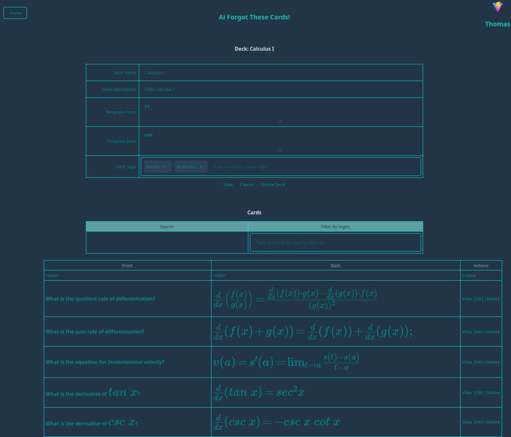

# Ai Forgot These Cards

[](https://github.com/darkmusic/ai-forgot-these-cards/actions/workflows/maven.yml)
[](https://github.com/darkmusic/ai-forgot-these-cards/actions/workflows/docker.yml)
[](https://github.com/darkmusic/ai-forgot-these-cards/actions/workflows/release.yml)

This is an AI-assisted flashcard creation and quiz website.

The _AI-assisted_ part initially enables chatting with an LLM during creation/editing of a flashcard.

This project consists of two parts:

1. **Backend**: (this repo)
   - Makes use of:
     - [Java](https://www.java.com/)
     - [Spring](https://spring.io/)
     - [JPA](https://www.oracle.com/java/technologies/persistence-jsp.html)
     - [Hibernate](https://hibernate.org/)
     - [Spring Security](https://spring.io/projects/spring-security)
     - [PostgreSQL](https://www.postgresql.org/)
     - [Llama.cpp](https://github.com/ggml-org/llama.cpp) for AI integration
     - [Maven](https://maven.apache.org/)
     - [GNU Make](https://www.gnu.org/software/make/) for build automation
     - [Sonatype Nexus](https://www.sonatype.com/products/repository-oss) for optional Maven dependency caching
2. **Frontend**: [ai-forgot-this-frontend](https://github.com/darkmusic/ai-forgot-this-frontend)
   - Makes use of:
     - [React](https://react.dev/)
     - [TypeScript](https://www.typescriptlang.org/)
     - [Sass](https://sass-lang.com/) for styling
     - [Vite](https://vite.dev/)
     - [GNU Make](https://www.gnu.org/software/make/) for build automation

Features:

- Fully containerless or fully/partially containerized solution with Docker/Rancher Desktop/Podman/etc.
- User management
- Admin management
- Spring Security
- (optional) Maven/APT dependency caching
- User profiles
- OpenAI / OpenAI-Compatible / Llama.cpp integration
  - Chat with a model
- Deck management
- Card management
  - Create a card with AI assistance
  - Edit card with AI assistance
  - View card
  - Markdown support for card content
  - Bulk entry/updating of cards
- Spaced Repetition System (SRS) for reviewing cards
- Deck-level SRS overview in the deck list (Due / New / Reviewed / Total)
- Start a per-deck SRS Review Session directly from the deck list
- Cram mode for studying all cards in a deck without affecting SRS scheduling
   - Filter cram sessions by card tags (Any/All match)
- Tag cloud widget in Cram and Review (font size indicates tag frequency; click tags to quickly filter)
- LaTeX support for rendering mathematical expressions

Runtime Requirements:

- (optional) Docker/Rancher Desktop/Podman/etc.
   - If you run the executable WAR (`*-exec.war`) in SQLite single-file mode, you can run fully standalone with no containers.
- A database (choose one):
   - **PostgreSQL** (default; typically run via the provided Docker targets)
   - **SQLite** single-file mode (optional; uses a persisted `.db` file)
- For AI features, choose one:
   - **Easy mode**: an API key for a hosted provider (e.g. OpenAI)
   - **Local mode (optional)**: Llama.cpp running an OpenAI-compatible server (can be on host or another machine)
- GNU Make is needed to run the provided Makefile commands.
- (optional) PostgreSQL client tools (psql, pg_dump, pg_restore) are only needed if you use the Postgres-specific `db/backup.sql` export/import targets locally.
  - If you export/import via the DB container (`*-container` targets) or use SQLite mode / portable migrations, you do not need local Postgres client tools.

Notes:

- You do not need to install JDK, Maven, or Node.js to build/run. All compilation happens inside Docker images via multi-stage builds.

Tip: You can speed up Docker builds by enabling an optional local Maven cache via Sonatype Nexus 3. See "Optional: Maven dependency cache (Nexus)" below.

Release process: see [CONTRIBUTING.md](CONTRIBUTING.md#releases).

## Architecture

### Application architecture

This diagram shows the main components of the application and their interactions.


### Deployment architecture

This diagram shows both container-based stacks and true containerless (local `java -jar`) options.

Note: “Full” vs “Core” is a deployment/topology choice (whether you run Nginx in front, and how you wire things up via environment variables, typically from [.env](.env)). The backend itself is the same application in all cases; there is a single backend image in CI.


## Screenshots

Here are some screenshots of the application:

1. **Login Screen**:\
   
2. **User Home Page, showing User Context Menu**\
   
3. **User Settings**:\
   
4. **Deck Management (with card template support)**:\
   
5. **View Card**:\
   
6. **View Card (with LaTeX support)**:\
   
7. **Edit Card (With AI Assistance)**:\
   
8. **Create Card (With AI Assistance)**:\
   
9. **Bulk Entry/Updating of Cards**:\
   
10. **SRS Review (Front of card, showing Markdown formatting)**:\
   
11. **SRS Review (Back of card, showing Markdown formatting)**:\
   
12. **Cram Session (studying all cards without SRS updates)**:\
   
13. **Admin Home**:\
   
14. **Add User**:\
   

## General Remarks

- This project is a work-in-progress and is intended for educational purposes only.
- AI integration supports two modes:
   - **Easy mode** (recommended for most users): configure an API key in `.env` (see `SPRING_AI_OPENAI_API_KEY`).
   - **Local mode**: run [Llama.cpp](https://github.com/ggml-org/llama.cpp) in OpenAI-compatible server mode and point the app at it (see `SPRING_AI_OPENAI_CHAT_BASE_URL`).
      - You will need to download a model in GGUF format. Example: `llama-server -m /path/to/smollm2-135m.gguf --port 8087 --host 0.0.0.0`.
- The frontend is a submodule of this repository, so you will need to clone the frontend separately or initialize and update submodules after cloning this repo.
- The application uses PostgreSQL as the default database.
   - Optional: SQLite single-file mode for deployments where you want a single persisted `.db` file.
      - Set `DB_VENDOR=sqlite`
      - Optionally override the file path with `SQLITE_DB_PATH` (default: `./db/cards.db`)
- AI is provided as assistance, but should not be assumed to be factually correct, especially regarding the intricacies of grammar and language. Always review the AI-generated content before saving it to ensure accuracy and appropriateness for your use case.
- Different models may provide different results, and the output quality will depend on the model used and the input provided.
- The loading of tensors by Llama.cpp can be slow, especially for larger models. Be patient while the model is loading.

## Study Modes

The application provides two distinct study modes:

### Review Mode (SRS-based)
- Accessed via the main "Review" navigation for an all-decks review
- Shows only cards that are due for review based on the Spaced Repetition System algorithm
- Includes quality rating buttons (Again, Hard, Good, Easy) after revealing the answer
- Ratings update the SRS schedule, adjusting when each card will next appear
- Ideal for efficient long-term retention and optimized study sessions
- Optional tag filtering during the session:
   - Select one or more card tags to filter the review queue
   - Choose whether cards must match **Any** selected tag (OR) or **All** selected tags (AND)
   - Tag suggestions are restricted to tags present in the current review queue (or the selected deck, for deck-specific review)
   - A tag cloud is shown to visualize tag frequency (larger tags appear more often) and can be clicked to toggle the filter

You can also start a deck-specific review session from the Decks table using the "Start Review Session" action next to a deck. This filters the queue to only cards from that deck that are due (including new/unreviewed cards).

### Cram Mode (All cards)
- Accessed via the "Cram" link next to each deck in the deck list
- Presents **all cards** in the selected deck, regardless of SRS status
- Simplified navigation with Previous/Next buttons and answer reveal toggle
- **Does not update** SRS schedules - perfect for pre-exam cramming or casual review
- No quality ratings required - just flip through the cards at your own pace
- Useful for getting familiar with new decks or intensive review before tests
- Optional tag filtering during the session:
   - Select one or more card tags to filter the cram queue
   - Choose whether cards must match **Any** selected tag (OR) or **All** selected tags (AND)
   - Tag suggestions are restricted to tags that exist on cards in the selected deck
   - A tag cloud is shown to visualize tag frequency (larger tags appear more often) and can be clicked to toggle the filter

### Deck list SRS columns
- The Decks table shows SRS counts per deck:
   - Due: cards due now (includes new cards)
   - New: cards in the deck that have never been reviewed
   - Reviewed: cards in the deck that have an existing SRS record
   - Total: total cards in the deck

These counts help you decide whether to review everything due or focus on a specific deck.

## Getting Started

To get started with the project, follow these steps:

1. Install Make if needed.
1. Copy `.env.example` to `.env` and customize as needed.
   - Common configuration options in `.env`:
     - `APP_SERVER_PORT`: Backend server port (default: 8080)
     - `SESSION_TIMEOUT`: Session idle timeout before requiring re-authentication (default: 30m). Common values: `30m`, `1h`, `2h`, `3600s`
     - `CONNECTION_TIMEOUT`: Tomcat HTTP connection timeout (default: 20s). Common values: `20s`, `30s`, `1m`
     - `ASYNC_REQUEST_TIMEOUT`: Spring MVC async request timeout (default: 30s). Common values: `30s`, `1m`, `2m`
   - `SPRING_AI_OPENAI_API_KEY`: API key for hosted AI (easy mode). Leave blank if using local Llama.cpp.
   - `SPRING_AI_OPENAI_CHAT_BASE_URL`: Optional override to use a local OpenAI-compatible server (e.g. Llama.cpp), default: `http://host.docker.internal:8087/v1`
   - `LLAMACPP_URL`: Legacy/compat URL for Llama.cpp (optional; prefer `SPRING_AI_OPENAI_CHAT_BASE_URL`)
     - `DB_URL`, `POSTGRES_USER`, `POSTGRES_PASSWORD`: Database connection settings
     - `USE_NEXUS_MAVEN`: Enable Maven dependency caching via Nexus (optional)
1. If on Windows, add/edit .wslconfig in your user home folder with settings (adjust as needed for memory, etc.):

      ```bash
      [wsl2]
      memory=16GB # Limits VM memory in WSL 2
      processors=2 # Makes the WSL 2 VM use this many virtual processors
      networkingMode=mirrored # Required to resolve an issue with Podman
      autoMemoryReclaim=gradual # To optimize memory reclaimation

      [automount]
      options = "metadata,umask=22,fmask=11" # To make windows disk access faster

      [experimental]
      sparseVhd=true # To minimize wsl container disk image use
    ```

1. Install Docker, Rancher Desktop, Podman, etc. if needed.
1. Clone the repository and initialize the submodules:

   ```bash
   git clone https://github.com/darkmusic/ai-forgot-these-cards
   cd ai-forgot-these-cards
   git submodule update --init
   ```

1. (Optional) Local AI mode: install Llama.cpp and download at least one model in GGUF format.
   1. Llama.cpp is included as a submodule in `dep/llama.cpp` for convenience.
   1. Start it with `make start-llamacpp` (set `LLAMA_MODEL_PATH` and `LLAMACPP_PORT` in `.env`) or run `llama-server` manually.
   1. If using Docker for the app, set `SPRING_AI_OPENAI_CHAT_BASE_URL` in `.env` to a URL reachable **from inside the container**.

1. (Optional) Prepare the frontend locally (not required for container builds)

  ```bash
  cd dep/ai-forgot-this-frontend
  npm install
  make compile-scss
  cd ../..
  ```

1. Back in the root directory, build and start the containers (this compiles the backend WAR and the frontend SPA inside Docker images).

   Recommended (simpler) deployment: **app + db only** (no Nginx). The app serves both the SPA UI and `/api`:

   ```bash
   make build-deploy-core
   ```

   Alternative (full stack / reverse-proxy parity): app + db + Nginx:

   ```bash
   make build-deploy
   ```

   To force a clean rebuild (no Docker layer cache), use:

   ```bash
   make build-deploy-nocache
   ```

1. Open your web browser:
   - Core stack: [http://localhost:8080](http://localhost:8080)
   - Full stack (Nginx): [http://localhost:8086](http://localhost:8086)
   Then log in with username "cards" and password "cards".
1. Go to the "Admin" section and add a user with the role "USER".
1. Change the "cards" admin user's password if needed.

### Optional: Maven dependency cache (Nexus)

To avoid re-downloading Maven dependencies on every image build, you can run a local Sonatype Nexus repository and point Maven to it during Docker builds.

Start Nexus 3 (runs independently and is not affected by other Makefile targets):

```bash
make nexus-up
make nexus-status   # optional
make nexus-logs     # optional: tail logs until ready
```

Enable the cache for app builds by setting an environment variable in `.env` before building:

```bash
USE_NEXUS_MAVEN=1
```

Details:

- When `USE_NEXUS_MAVEN=1` is set, the backend Docker build injects a Maven mirror into the builder image, using `NEXUS_MAVEN_MIRROR_URL` (defaults to Nexus 3's maven-public group at `http://host.docker.internal:8081/repository/maven-public`).
- If you would like to create a custom group named `maven-group`, create it in the Nexus UI, and then set `USE_NEXUS_MAVEN` and `NEXUS_MAVEN_MIRROR_URL` in `.env` before building.

- The Nexus container remains running at all times and is not stopped by `make down` or other targets. To stop or remove it explicitly, use:

   ```bash
   make nexus-down
   ```

- Note that you may also host a Nexus instance on another machine or server, and point to that by setting `NEXUS_MAVEN_MIRROR_URL` in `.env`.

Troubleshooting:

- It can take 1–2 minutes for Nexus to become fully ready on first run. If builds fail to reach the mirror, retry after Nexus is up.
- On Linux, the build uses `host.docker.internal` via Docker's `--add-host=host.docker.internal:host-gateway` to reach the host. If your Docker version doesn't support `host-gateway`, replace `host.docker.internal` with your host IP in `NEXUS_MAVEN_MIRROR_URL`.

#### Optional: APT dependency proxies (Nexus) for Docker builds

To speed up apt operations in the app+web Docker image builds and reduce network flakiness, you can point the build to Nexus APT proxy repositories. These are optional and only used during Docker builds for the app and web images.

1) In Nexus, create APT (proxy) repositories for the upstreams you need:
   - Ubuntu Noble: archive.ubuntu.com and security.ubuntu.com
   - Debian Bookworm: deb.debian.org and security.debian.org

2) Copy each repository’s HTTP URL and set the corresponding variables in your `.env`:
   ```bash
   # Ubuntu Noble
   NEXUS_APT_MIRROR_ARCHIVE_UBUNTU_NOBLE_URL=http://localhost:8081/repository/archive.ubuntu.com-noble-apt-proxy/
   NEXUS_APT_MIRROR_SECURITY_UBUNTU_NOBLE_URL=http://localhost:8081/repository/security.ubuntu.com-noble-apt-proxy/

   # Debian Bookworm
   NEXUS_APT_MIRROR_DEBIAN_BOOKWORM_URL=http://localhost:8081/repository/deb.debian.org-bookworm-apt-proxy/
   NEXUS_APT_MIRROR_SECURITY_DEBIAN_BOOKWORM_URL=http://localhost:8081/repository/deb.debian.org-bookworm-security-apt-proxy/
   ```

Notes:
- If these variables are set, the app/web Dockerfile builds will use them to replace default APT sources for the matching base image (Ubuntu Noble or Debian Bookworm).
- If unset, the build falls back to public upstream mirrors.
- On Linux hosts, you can also host Nexus on another machine and point the URLs above to that host.

## Exporting the database

This will export the database to `db/backup.sql`.

Notes:

1. If `db/backup.sql` already exists, it is archived as `db/backup1.sql`, `db/backup2.sql`, etc.
   - To see what backups you have, run: `make list-backups`
1. You will be required to enter the password when this runs.
1. By default, this assumes you have the PostgreSQL client tools installed locally. If you want to export from the DB container instead, use the `export-db-container` target.

```bash
make export-db
```

## Importing the database

Notes:

1. This will drop the current database, so be sure you have exported it first!
1. You will be required to enter the password when this runs.
1. You must have a valid `db/backup.sql` file to import from.
1. By default, this assumes you have the PostgreSQL client tools installed locally. If you want to import into the DB container instead, use the `import-db-container` target.

```bash
make import-db
```

## Portable migrations (Postgres <-> SQLite)

In addition to `db/backup.sql` (Postgres-only), the project supports a vendor-neutral **portable dump** format (ZIP + JSONL) for migrating data between Postgres and SQLite.

Artifacts:

- `db/portable-dump.zip` (portable dump ZIP)
- `db/cards.db` (SQLite database file; used when `DB_VENDOR=sqlite`)

Common workflows:

```bash
# Postgres -> SQLite (overwrites db/cards.db by default)
make migrate-postgres-to-sqlite

# SQLite -> Postgres (imports into the Postgres DB container)
make migrate-sqlite-to-postgres
```

Advanced usage:

```bash
# Export only
make portable-export-postgres
make portable-export-sqlite

# Validate structure of db/portable-dump.zip
make validate-portable

# Import only (defaults to truncating target tables first)
make portable-import-postgres
make portable-import-sqlite

# Safer import mode (fails if target DB is not empty)
PORTABLE_IMPORT_MODE=fail-if-not-empty make portable-import-postgres
PORTABLE_IMPORT_MODE=fail-if-not-empty make portable-import-sqlite
```

Notes:

- These targets do **not** use `db/backup.sql`; they read/write `db/portable-dump.zip` and (for SQLite) `db/cards.db`.
- The wrapper targets (`migrate-*`) run export then import **sequentially** to avoid issues in environments that set parallel make flags.
- `make validate-portable` runs inside the app container (runnable WAR) and may initialize the application context; treat it as a validation tool for the ZIP structure (not a pure read-only operation).

## Actuator Endpoints

- The application exposes several actuator endpoints for monitoring and management. You can access them here: [Actuator](http://localhost:8080/actuator).

## Swagger Endpoint

- The Swagger UI endpoint is available here: [Swagger UI](http://localhost:8080/swagger-ui/index.html)

## Standalone (no Docker) (advanced)

This project produces both a standard WAR and a runnable WAR:

- `target/ai-forgot-these-cards-<version>.war` (deploy to Tomcat)
- `target/ai-forgot-these-cards-<version>-exec.war` (run with `java -jar`)

Example:

```bash
./mvnw -DskipTests package
java -jar target/ai-forgot-these-cards-<version>-exec.war
```

True containerless single-file mode (SQLite):

```bash
make run-standalone-sqlite
```

True containerless mode with an external Postgres:

```bash
make run-standalone-postgres
```

Notes:

- This expects a Postgres server reachable at the default `DB_URL` (`jdbc:postgresql://localhost:5433/cards`) unless you override `DB_URL`.
- Example override for a locally-installed Postgres on `5432`:

   ```bash
   DB_URL=jdbc:postgresql://localhost:5432/cards make run-standalone-postgres
   ```

Notes:

- By default, the executable WAR will try to connect to Postgres on `localhost:5433` (matching the Makefile’s DB container port mapping). You must have a Postgres server running there.
   - Easiest option: start the DB container via `make up-core` (or `make up`) in another terminal.
   - If you use a locally-installed Postgres on `5432`, set `DB_URL=jdbc:postgresql://localhost:5432/cards`.
- If you don’t want to run Postgres locally, you can run in SQLite mode:

   ```bash
   DB_VENDOR=sqlite SQLITE_DB_PATH=./db/cards.db java -jar target/ai-forgot-these-cards-<version>-exec.war
   ```

AI provider selection (optional):

- Hosted (OpenAI): set `SPRING_AI_OPENAI_API_KEY` (typically in `.env`)
- Local/remote (Llama.cpp OpenAI-compatible): set `SPRING_AI_OPENAI_CHAT_BASE_URL` (typically in `.env`)

### API notes
- SRS statistics: `GET /api/srs/stats` now accepts an optional `deckId` query parameter.
   - Without `deckId`, returns aggregate stats across all decks for the authenticated user.
   - With `deckId`, returns stats scoped to that specific deck (Due/New/Reviewed/Total).

## Roadmap

- [x] Add theme support, and enable switching between themes.
- [x] Add formatting for flashcards (e.g., Markdown support).
- [x] Add template support for flashcards.
- [x] Enable administrative exporting and importing of the database.
- [x] Create docker-compose for app and website and move entire solution to containers.
- [x] Transition from docker-compose to docker CLI commands.
- [x] Transition to Llama.cpp instead of Ollama.
- [x] Transition to GNU Make instead of Just.
- [x] Transition from using Ollama Spring API to Spring AI OpenAI-compatible API.
- [x] Remove dependency on local building and build entirely inside containers.
- [x] Create .env file support for configuration.
- [x] Add Maven dependency caching via Sonatype Nexus 3.
- [x] Add LaTeX support for rendering mathematical expressions.
- [x] Add APT dependency caching via Sonatype Nexus 3 for Docker builds.
- [x] Implement a more sophisticated quiz system with spaced repetition.
- [x] Add cram mode for studying all cards without affecting SRS scheduling.
- [x] Add swagger/openapi support for the REST API.
- [x] Add bulk entry/updating of cards.
- [x] Add tag filtering in cram and review sessions, with tag cloud widget.
- [x] Implement OpenAI API key support for easy AI integration.
- [x] Add "core stack" deployment option (app + db only, no Nginx).
- [x] Add SQLite single-file mode as an alternative to PostgreSQL for simpler deployments.
- [ ] Create low-friction deployment options (e.g., single-container with embedded DB, managed DB service, Pinokio, etc.).
- [ ] Add support for importing/exporting flashcards in different formats (e.g., CSV, YAML, TOML, Anki).
- [ ] Add profile picture upload support.
- [ ] Add support for statistics and progress tracking.
- [ ] Add support for multiple UI languages.
- [ ] Evaluate possible agentic or other AI-assisted integration, such as using the AI to create flashcards based on user input or other sources.
- [ ] Consider supporting other / custom frontends, such as a mobile app or a different web framework.
- [ ] Add support for more AI models and providers.
