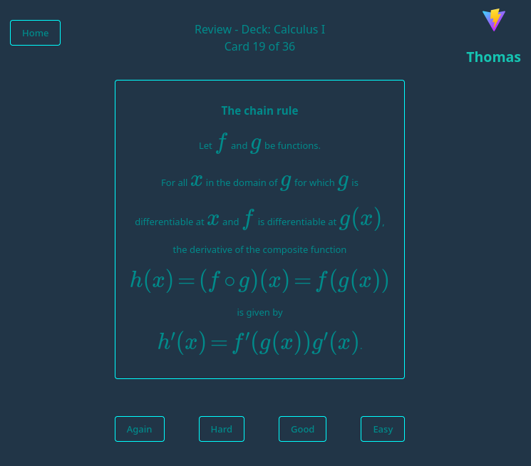

# Ai Forgot These Cards

AI-assisted flashcards: create decks/cards, study via SRS Review or Cram mode, and (optionally) chat with an LLM while authoring cards.

## Installation

Two supported installation paths:

1) **GitHub Releases (WAR artifacts)**
	- Download: https://github.com/darkmusic/ai-forgot-these-cards/releases
	- Install guide: https://darkmusic.github.io/ai-forgot-these-cards/releases.html

2) **Prebuilt container images (GHCR)**
	- Images:
	  - `ghcr.io/darkmusic/ai-forgot-these-cards-app`
	  - `ghcr.io/darkmusic/ai-forgot-these-cards-web`
	- Install guide: https://darkmusic.github.io/ai-forgot-these-cards/container-images.html

## Quick links

- Documentation: https://darkmusic.github.io/ai-forgot-these-cards/overview.html
- Frontend repo: https://github.com/darkmusic/ai-forgot-this-frontend
- Contributing / releases: [CONTRIBUTING.md](CONTRIBUTING.md)
- License: [LICENSE.txt](LICENSE.txt)
