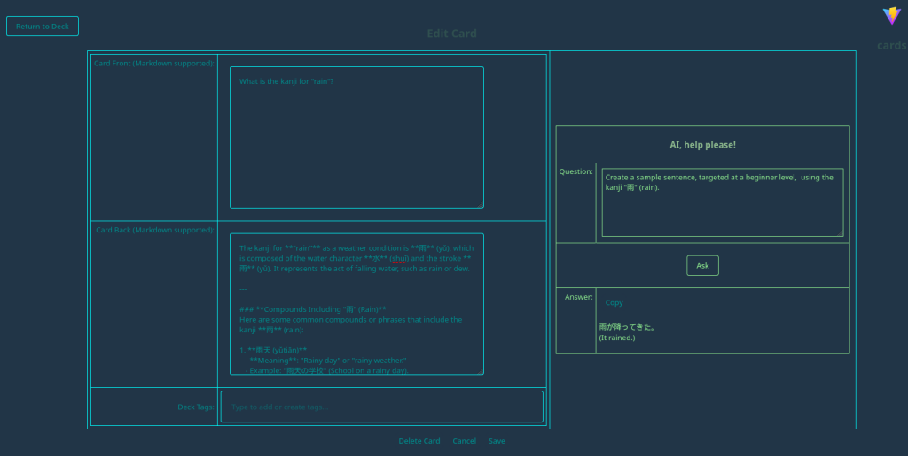

# Ai Forgot These Cards

This is an AI-assisted flashcard creation and quiz website.

The _AI-assisted_ part initially enables chatting with an LLM during creation/editing of a flashcard.

This project consists of two parts:

1. **Backend**: (this repo)
   - Makes use of:
     - [Java](https://www.java.com/)
     - [Spring](https://spring.io/)
     - [JPA](https://www.oracle.com/java/technologies/persistence-jsp.html)
     - [Hibernate](https://hibernate.org/)
     - [Spring Security](https://spring.io/projects/spring-security)
     - [PostgreSQL](https://www.postgresql.org/)
     - [Llama.cpp](https://github.com/ggml-org/llama.cpp) for AI integration
     - [Maven](https://maven.apache.org/)
     - [GNU Make](https://www.gnu.org/software/make/) for build automation
     - [Sonatype Nexus](https://www.sonatype.com/products/repository-oss) for optional Maven dependency caching
2. **Frontend**: [ai-forgot-this-frontend](https://github.com/darkmusic/ai-forgot-this-frontend)
   - Makes use of:
     - [React](https://react.dev/)
     - [TypeScript](https://www.typescriptlang.org/)
     - [Sass](https://sass-lang.com/) for styling
     - [Vite](https://vite.dev/)
     - [GNU Make](https://www.gnu.org/software/make/) for build automation

Features:

- Fully containerized with Docker/Rancher Desktop/Podman/etc.
- User management
- Admin management
- Spring Security
- Optional Maven/APT dependency caching
- User profiles
- Llama.cpp integration
  - Chat with a model
- Deck management
- Card management
  - Create a card with AI assistance
  - Edit card with AI assistance
  - View card
  - Markdown support for card content
- Quiz

Runtime Requirements:

- Docker/Rancher Desktop/Podman/etc.
- Llama.cpp must be installed and running (can be on host or another machine)
- GNU Make is needed to run the provided Makefile commands.

Notes:

- You do not need to install JDK, Maven, or Node.js to build/run. All compilation happens inside Docker images via multi-stage builds.

Tip: You can speed up Docker builds by enabling an optional local Maven cache via Sonatype Nexus 3. See "Optional: Maven dependency cache (Nexus)" below.

## Architecture

### Application architecture


### Container architecture


## Screenshots

Here are some screenshots of the application:

1. **Login Screen**:

   
2. **User Home Page, showing User Context Menu**:

   
3. **User Settings**:

   
4. **Deck Management (with card template support)**:

   
5. **View Card**:

   
6. **View Card (with LaTeX support)**:

   

7. **Edit Card (With AI Assistance)**:

   
8. **Create Card (With AI Assistance)**:

   
9. **Quiz (Front of card, showing Markdown formatting)**:

   
10. **Quiz (Back of card, showing Markdown formatting)**:

   
11. **Admin Home**:

   
12. **Add User**:

   

## General Remarks

- This project is a work-in-progress and is intended for educational purposes only.
- The AI integration is done using [Llama.cpp](https://github.com/ggml-org/llama.cpp), which must be installed and running on your local machine. You will need to download a model in GGUF format, and point to this model when starting the Llama.cpp server. For example, if you have a model named `smollm2-135m.gguf`, you would start the server with the command `llama-server -m /path/to/smollm2-135m.gguf`.
- The frontend is a submodule of this repository, so you will need to clone the frontend separately or initialize and update submodules after cloning this repo.
- The application uses PostgreSQL as the database, and you can run it using Docker, Rancher Desktop, etc.. Alternatively, you can configure it to connect to an existing PostgreSQL server by updating the connection settings in `src/main/resources/application.properties`.
- AI is provided as assistance, but should not be assumed to be factually correct, especially regarding the intricacies of grammar and language. Always review the AI-generated content before saving it to ensure accuracy and appropriateness for your use case.
- Different models may provide different results, and the output quality will depend on the model used and the input provided.
- The loading of tensors by Llama.cpp can be slow, especially for larger models. Be patient while the model is loading.

## Getting Started

To get started with the project, follow these steps:

1. Install Make if needed.
1. Copy `.env.example` to `.env` and customize as needed.
1. If on Windows, add/edit .wslconfig in your user home folder with settings (adjust as needed for memory, etc.):

      ```bash
      [wsl2]
      memory=16GB # Limits VM memory in WSL 2
      processors=2 # Makes the WSL 2 VM use this many virtual processors
      networkingMode=mirrored # Required to resolve an issue with Podman
      autoMemoryReclaim=gradual # To optimize memory reclaimation

      [automount]
      options = "metadata,umask=22,fmask=11" # To make windows disk access faster

      [experimental]
      sparseVhd=true # To minimize wsl container disk image use
    ```

1. Install Llama.cpp and download at least one model in GGUF format (e.g., `llama2` or `smollm2:135m`).
    1. Note that Llama.cpp can also be manually built if desired, and is included as a submodule in `dep/llama.cpp` for convenience (note that you may wish to do a `git pull` inside the submodule directory to ensure you have the latest, as rapid development within llamacpp will quickly cause the submodule to become out of date).
1. Make sure Llama.cpp is running via `llama-server -m /path/to/model.gguf --port 8087` (add --host if needed).
1. Update the `LLAMACPP_URL` setting in `.env` to a URL reachable from inside the `app` container (default may be `http://host.docker.internal:8087` or the LAN IP of your host, depending on your platform).
1. Install Docker, Rancher Desktop, Podman, etc. if needed.
1. Clone the repository and initialize the submodules:

   ```bash
   git clone https://github.com/darkmusic/ai-forgot-these-cards
   cd ai-forgot-these-cards
   git submodule update --init
   ```

1. Build and start the containers (this compiles the backend WAR and the frontend SPA inside Docker images):

   ```bash
   make build-deploy
   ```

1. Open your web browser, navigate to [http://localhost:8086](http://localhost:8086), and log in with username "cards" and password "cards".
1. Go to the "Admin" section and add a user with the role "USER".
1. Change the "cards" admin user's password if needed.

### Optional: Maven dependency cache (Nexus)

To avoid re-downloading Maven dependencies on every image build, you can run a local Sonatype Nexus repository and point Maven to it during Docker builds.

Start Nexus 3 (runs independently and is not affected by other Makefile targets):

```bash
make nexus-up
make nexus-status   # optional
make nexus-logs     # optional: tail logs until ready
```

Enable the cache for app builds by setting an environment variable in `.env` before building:

```bash
USE_NEXUS_MAVEN=1
```

Details:

- When `USE_NEXUS_MAVEN=1` is set, the backend Docker build injects a Maven mirror into the builder image, using `NEXUS_MAVEN_MIRROR_URL` (defaults to Nexus 3's maven-public group at `http://host.docker.internal:8081/repository/maven-public`).
- If you would like to create a custom group named `maven-group`, create it in the Nexus UI, and then set `USE_NEXUS_MAVEN` and `NEXUS_MAVEN_MIRROR_URL` in `.env` before building.

- The Nexus container remains running at all times and is not stopped by `make down` or other targets. To stop or remove it explicitly, use:

   ```bash
   make nexus-down
   ```

- Note that you may also host a Nexus instance on another machine or server, and point to that by setting `NEXUS_MAVEN_MIRROR_URL` in `.env`.

Troubleshooting:

- It can take 1–2 minutes for Nexus to become fully ready on first run. If builds fail to reach the mirror, retry after Nexus is up.
- On Linux, the build uses `host.docker.internal` via Docker's `--add-host=host.docker.internal:host-gateway` to reach the host. If your Docker version doesn't support `host-gateway`, replace `host.docker.internal` with your host IP in `NEXUS_MAVEN_MIRROR_URL`.

#### Optional: APT dependency proxies (Nexus) for Docker builds

To speed up apt operations in the app+web Docker image builds and reduce network flakiness, you can point the build to Nexus APT proxy repositories. These are optional and only used during Docker builds for the app and web images.

1) In Nexus, create APT (proxy) repositories for the upstreams you need:
   - Ubuntu Noble: archive.ubuntu.com and security.ubuntu.com
   - Debian Bookworm: deb.debian.org and security.debian.org

2) Copy each repository’s HTTP URL and set the corresponding variables in your `.env`:
   ```bash
   # Ubuntu Noble
   NEXUS_APT_MIRROR_ARCHIVE_UBUNTU_NOBLE_URL=http://localhost:8081/repository/archive.ubuntu.com_noble/
   NEXUS_APT_MIRROR_SECURITY_UBUNTU_NOBLE_URL=http://localhost:8081/repository/security.ubuntu.com_noble/

   # Debian Bookworm
   NEXUS_APT_MIRROR_DEBIAN_BOOKWORM_URL=http://localhost:8081/repository/deb.debian.org-bookworm-apt-proxy/
   NEXUS_APT_MIRROR_SECURITY_DEBIAN_BOOKWORM_URL=http://localhost:8081/repository/deb.debian.org-bookworm-security-apt-proxy/
   ```

Notes:
- If these variables are set, the app/web Dockerfile builds will use them to replace default APT sources for the matching base image (Ubuntu Noble or Debian Bookworm).
- If unset, the build falls back to public upstream mirrors.
- On Linux hosts, you can also host Nexus on another machine and point the URLs above to that host.

## Exporting the database

This will export the database to `db/backup.sql`.

Notes:

1. This will first delete the existing backup, so back up the backup if you want to keep it.
1. You will be required to enter the password when this runs.

```bash
make export-db
```

## Importing the database

Notes:

1. This will drop the current database, so be sure you have exported it first!
1. You will be required to enter the password when this runs.

```bash
make import-db
```

## Actuator Endpoints

- The application exposes several actuator endpoints for monitoring and management. You can access them at `http://localhost:8080/actuator`.

## Roadmap

- [x] Add theme support, and enable switching between themes.
- [x] Add formatting for flashcards (e.g., Markdown support).
- [x] Add template support for flashcards.
- [x] Enable administrative exporting and importing of the database.
- [x] Create docker-compose for app and website and move entire solution to containers.
- [x] Transition from docker-compose to docker CLI commands.
- [x] Transition to Llama.cpp instead of Ollama.
- [x] Transition to GNU Make instead of Just.
- [x] Transition from using Ollama Spring API to Spring AI OpenAI-compatible API.
- [x] Remove dependency on local building and build entirely inside containers.
- [x] Create .env file support for configuration.
- [x] Add Maven dependency caching via Sonatype Nexus 3.
- [x] Add LaTeX support for rendering mathematical expressions.
- [x] Add APT dependency caching via Sonatype Nexus 3 for Docker builds.
- [ ] Add swagger/openapi support for the REST API.
- [ ] Add support for importing/exporting flashcards in different formats (e.g., CSV, YAML, TOML, Anki).
- [ ] Add profile picture upload support.
- [ ] Implement a more sophisticated quiz system with spaced repetition.
- [ ] Add support for statistics and progress tracking.
- [ ] Add support for multiple UI languages.
- [ ] Evaluate possible agentic or other AI-assisted integration, such as using the AI to create flashcards based on user input or other sources.
- [ ] Consider supporting other / custom frontends, such as a mobile app or a different web framework.
- [ ] Add support for more AI models and providers.
