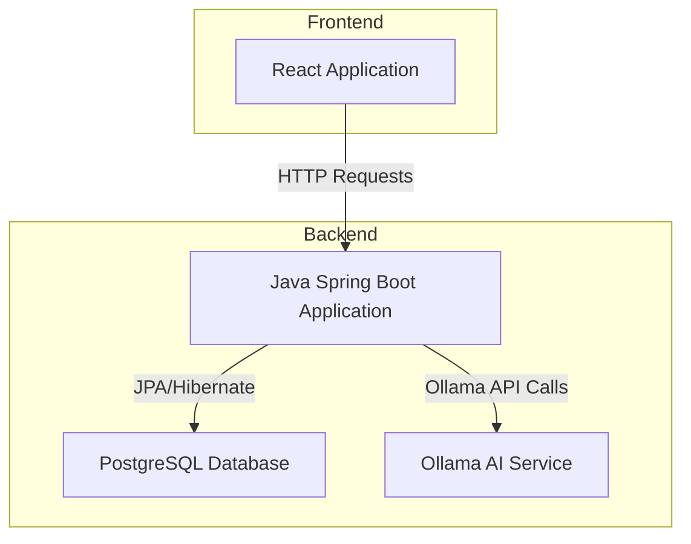

# Ai Forgot These Cards

This is an AI-assisted flashcard creation and quiz website.

The _AI-assisted_ part initially enables chatting with an LLM during creation/editing of a flashcard.

This project consists of two parts:

1. **Backend**: (this repo)
   - Makes use of:
     - [Java](https://www.java.com/)
     - [Spring](https://spring.io/)
     - [JPA](https://www.oracle.com/java/technologies/persistence-jsp.html)
     - [Hibernate](https://hibernate.org/)
     - [Spring Security](https://spring.io/projects/spring-security)
     - [PostgreSQL](https://www.postgresql.org/)
     - [Ollama](https://ollama.com/) for AI integration
     - [Maven](https://maven.apache.org/)
     - [Just](https://just.systems/) for build automation
2. **Frontend**: [ai-forgot-this-frontend](https://github.com/darkmusic/ai-forgot-this-frontend)
    - Makes use of:
      - [React](https://react.dev/)
      - [TypeScript](https://www.typescriptlang.org/)
      - [Sass](https://sass-lang.com/) for styling
      - [Vite](https://vite.dev/)
      - [Just](https://just.systems/) for build automation

Features:

- Fully containerized with Docker/Rancher Desktop/Podman/etc.
- User management
- Admin management
- Spring Security
- User profiles
- Ollama integration
  - List models
  - Add/pull model
  - Chat with a model
- Deck management
- Card management
  - Create a card with AI assistance
  - Edit card with AI assistance
  - View card
  - Markdown support for card content
- Quiz

Runtime Requirements:

- Java Runtime, currently tested with Java 21 (GraalVM-21.0.8+12.1)
- PostgreSQL - A PostgreSQL container must be up and running (see [compose.yaml](compose.yaml)), or another existing PostgreSQL server must be available
- Ollama must be installed and running
- Docker/Rancher Desktop/Podman/etc.

## Architecture

### Application architecture



### Container architecture


## Screenshots

Here are some screenshots of the application:

1. **Login Screen**:
   
2. **User Home Page, showing User Context Menu**:
   
3. **User Settings**:
   
4. **Deck Management (with card template support)**:
   
5. **View Card**:
   
6. **Edit Card**:
   
7. **Create Card (With AI Assistance)**:
   
8. **Quiz (Front of card, showing Markdown formatting)**:
   
9. **Quiz (Back of card, showing Markdown formatting)**:
   
10. **Admin Home**:
    
11. **Add User**:
    
12. **Add Model**:
    

## General Remarks

- This project is a work-in-progress and is intended for educational purposes only.
- The AI integration is done using [Ollama](https://ollama.com/), which must be installed and running on your local machine. You can add models to Ollama and use them in the application.
- The frontend is a submodule of this repository, so you will need to clone the frontend separately or initialize and update submodules after cloning this repo.
- The application uses PostgreSQL as the database, and you can run it using Docker, Rancher Desktop, etc., with the provided `compose.yml` file. Alternatively, you can configure it to connect to an existing PostgreSQL server by commenting out the `db` service in `compose.yml` and updating the connection settings in `src/main/resources/application.properties`.
- AI is provided as assistance, but should not be assumed to be factually correct, especially regarding the intricacies of grammar and language. Always review the AI-generated content before saving it to ensure accuracy and appropriateness for your use case.
- Different models may provide different results, and the output quality will depend on the model used and the input provided.

## Getting Started

To get started with the project, follow these steps:

1. Download and install Ollama if needed, and run it via `ollama serve`."
1. Install Just if needed.

   ```powershell
   brew install just
   ```

   or

   ```powershell
   scoop install just
   ```

   or

   ```powershell
   choco install just
   ```

    or

    ```powershell
   paru -S just
   ```

1. If on Windows, add/edit .wslconfig in your user home folder with settings (adjust as needed for memory, etc.):

```bash
[wsl2]
memory=16GB # Limits VM memory in WSL 2
processors=2 # Makes the WSL 2 VM use this many virtual processors
networkingMode=mirrored # Required to resolve an issue with Podman
autoMemoryReclaim=gradual # To optimize memory reclaimation

[automount]
options = "metadata,umask=22,fmask=11" # To make windows disk access faster

[experimental]
sparseVhd=true # To minimize wsl container disk image use
```

1. Install Docker, Rancher Desktop, Podman, etc. if needed.
1. Install [PowerShell](https://github.com/PowerShell/PowerShell) if needed, as this will be used for running Just commands.
1. Clone the repository and initialize the submodules:

   ```powershell
   git clone https://github.com/darkmusic/ai-forgot-these-cards
   cd ai-forgot-these-cards
   git submodule update --init
   ```

1. Install JDK 21 and Maven.

- GraalVM 21 (GraalVM-21.0.8+12.1) has been confirmed to work, though other JDKs may also work.

1. In src/dep/ai-forgot-this-frontend, run:

   ```powershell
   npm install
   ```

1. If needed, install sass globally:

   ```powershell
   npm install -g sass
   ```

1. Make sure your JAVA_HOME is set to the correct JDK version:
Note: This is a temporary setting for the current session. You may want to set it permanently in your system environment variables.

   ```powershell
   $env:JAVA_HOME = "C:\path\to\your\jdk"
   ```

1. Ensure your PATH variable points to the correct Java binary.
Note: this just temporarily adds the JDK to the PATH for the current session. You may want to add it permanently to your system environment variables.

   ```powershell
   $env:PATH += ";$env:JAVA_HOME"
   ```

1. Customize the `docker-compose.yaml` file if needed, and then build and start the containers:

   ```powershell
   just build-deploy
   ```

1. Open your web browser, navigate to [http://localhost:8086](http://localhost:8086), and log in with username "cards" and password "cards".
1. Go to the "Admin" section and add a user with the role "USER".
1. Change the "cards" admin user's password if needed.
1. Add a model to Ollama using the admin interface (e.g., `llama2` or `smollm2:135m`).

## Exporting the database

This will export the database to `db/backup.sql`.

Notes:

1. This will first delete the existing backup, so back up the backup if you want to keep it.
1. You will be required to enter the password when this runs.

```powershell
just export-db
```

## Importing the database

Notes:

1. This will drop the current database, so be sure you have exported it first!
1. You will be required to enter the password when this runs.

```powershell
just import-db
```

## Actuator Endpoints

- The application exposes several actuator endpoints for monitoring and management. You can access them at `http://localhost:8080/actuator`.

## Roadmap

- [X] Add theme support, and enable switching between themes.
- [X] Add formatting for flashcards (e.g., Markdown support).
- [X] Add template support for flashcards.
- [X] Enable administrative exporting and importing of the database.
- [X] Create docker-compose for app and website and move entire solution to containers.
- [ ] Remove dependency on local building and build entirely inside containers.
- [ ] Add swagger/openapi support for the REST API.
- [ ] Add support for importing/exporting flashcards in different formats (e.g., CSV, YAML, TOML, Anki).
- [ ] Add profile picture upload support.
- [ ] Implement a more sophisticated quiz system with spaced repetition.
- [ ] Add support for statistics and progress tracking.
- [ ] Add support for multiple UI languages.
- [ ] Evaluate possible agentic or other AI-assisted integration, such as using the AI to create flashcards based on user input or other sources.
- [ ] Consider supporting other / custom frontends, such as a mobile app or a different web framework.
- [ ] Add support for more AI models and providers.
