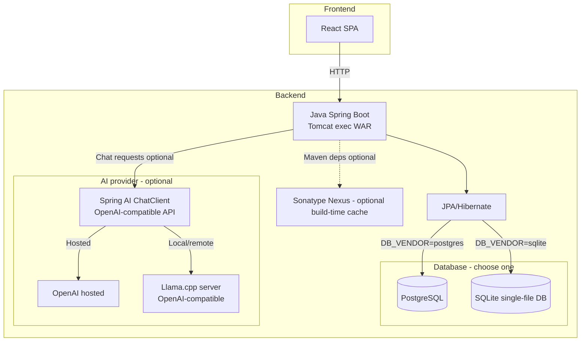

# Architecture

Ai Forgot These Cards is built as a SPA + backend + database, with optional AI integration.

## Application architecture

- **Frontend**: React/Vite SPA
- **Backend**: Spring Boot application packaged as a WAR and run on Tomcat
- **Persistence**: JPA/Hibernate, backed by Postgres (default) or SQLite single-file mode
- **AI (optional)**: Spring AI ChatClient talking to an OpenAI-compatible API (hosted provider or llama.cpp)

## Deployment topologies

- **Core stack**: app + database (app serves UI + API)
- **Full stack**: Nginx serves the SPA and proxies `/api` to the app
- **SQLite variants**: replace Postgres with a mounted SQLite `.db` file

See: [Deployment.md](Deployment.md)
