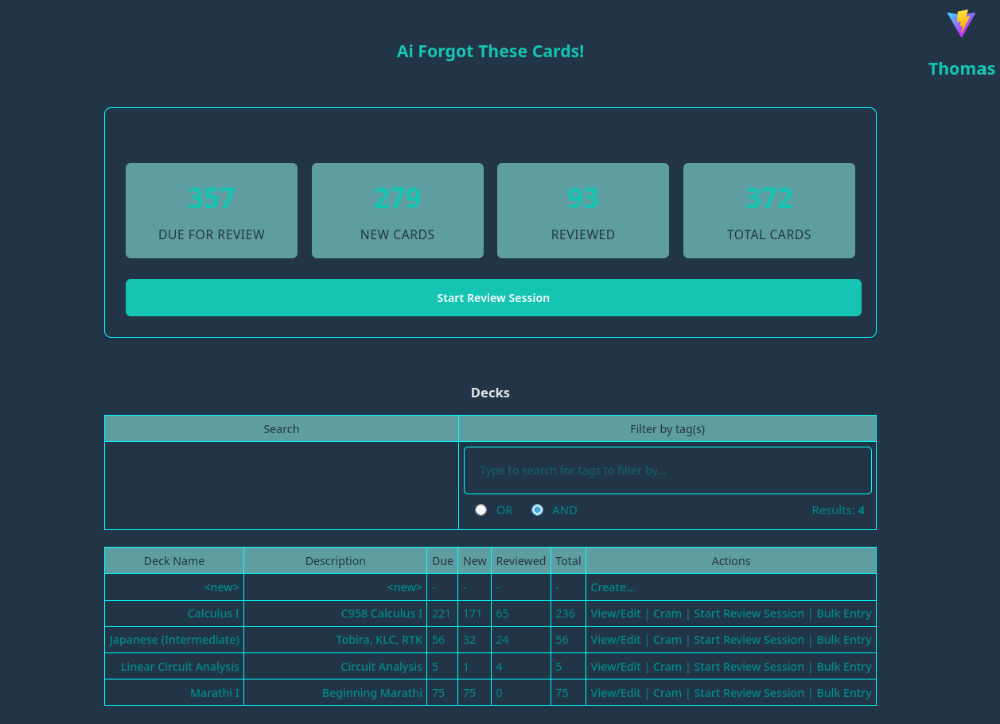
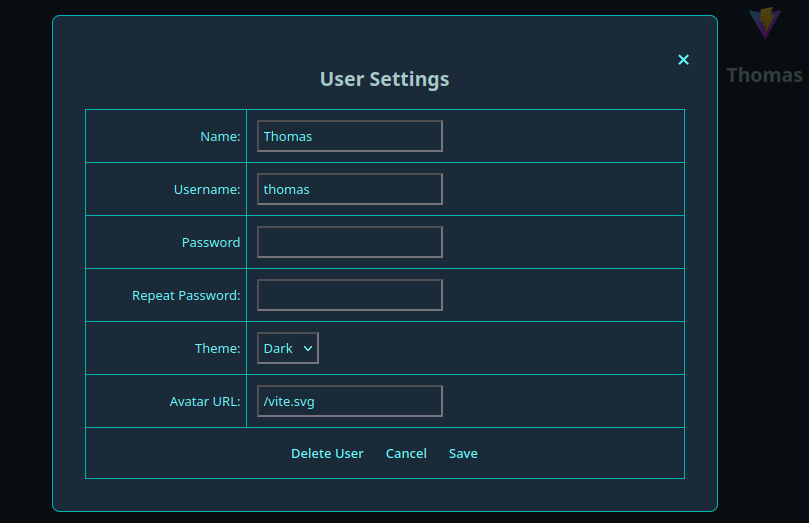
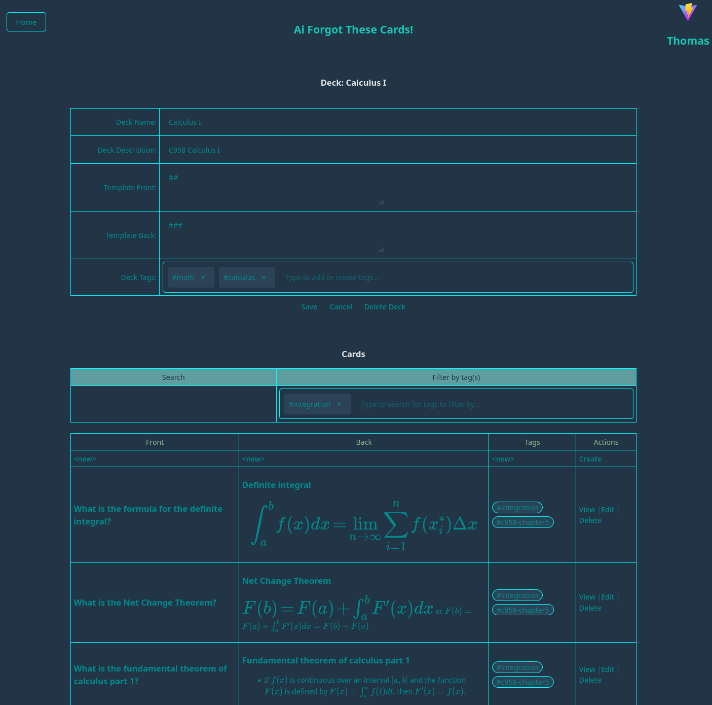
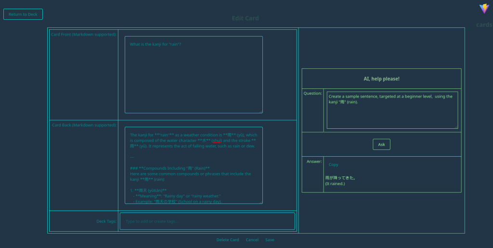
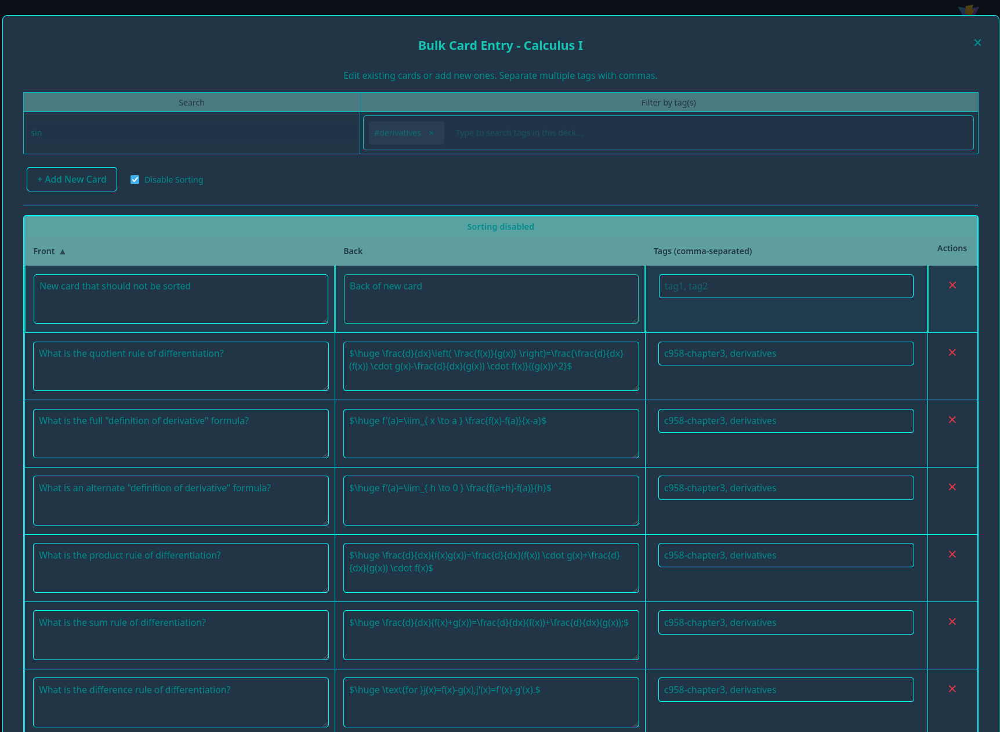
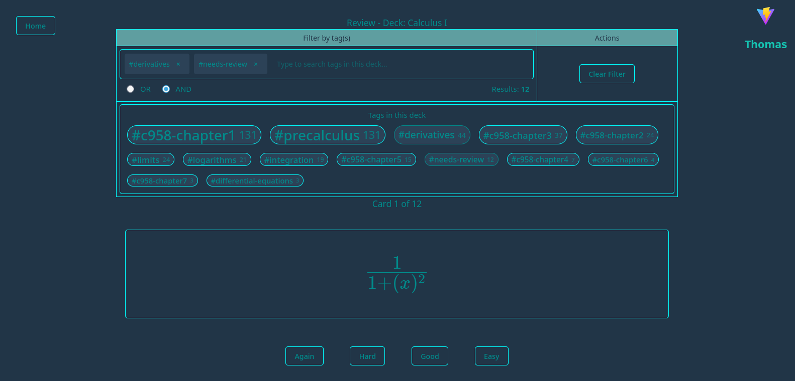
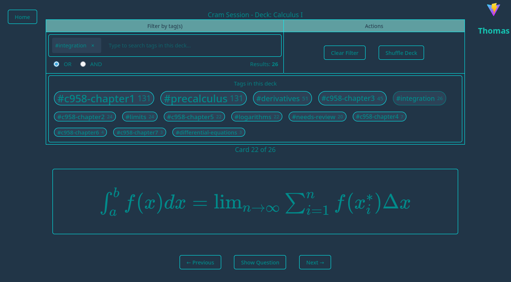
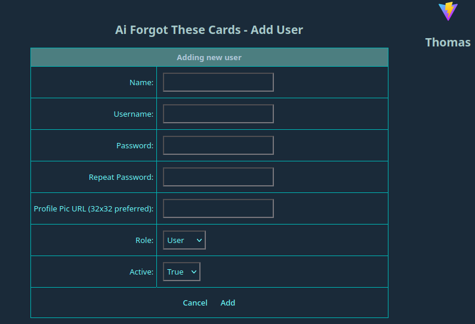

# Screenshots

This page shows some key screens from **Ai Forgot These Cards**.

> Tip: If you run the full stack (`make build-deploy`), open http://localhost:8086. For the core stack (`make build-deploy-core`), open http://localhost:8080.

## Login

## Home

## User settings

## Deck management

## View card

## View card (LaTeX)

## Edit card (AI assistance)

## Create card (AI assistance)

## Bulk entry/updating

## Review (front)

## Review (back)

## Cram session

## Admin

## Add user

